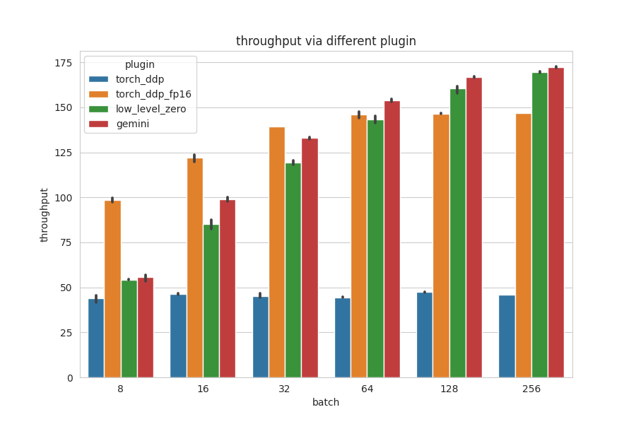

# # ViT Training Benchmark with ColossalAI

**CHEN Han(A0274739M, chenhan@u.nus.edu)**

[Concyclics/ViT-Training-Benchmark-with-ColossalAI (github.com)](https://github.com/Concyclics/ViT-Training-Benchmark-with-ColossalAI)

## Benchmark

In this repo, we bench 4 boosting method in [ColossalAI](https://github.com/hpcaitech/ColossalAI) with [Kaggle](https://www.kaggle.com)'s free T4x2 GPU and see the performance of different settings. Each combination of settings will be tested by 3 times.

### How to run

You can directly run the shell below to test or use the [vit-benchmark-with-colossalai.ipynb](./vit-benchmark-with-colossalai.ipynb) to bench the speed and get visualization on Kaggle. Or you can directly visit my public Kaggle notebook. [ViT benchmark with ColossalAI (kaggle.com)](https://www.kaggle.com/code/concyclics/vit-benchmark-with-colossalai/notebook).

```bash
git clone https://github.com/hpcaitech/ColossalAI.git
cd /kaggle/working/ColossalAI/examples/images/vit
bash my_benchmark.sh > log.txt 2> errors.txt
```

### Config

#### Model

* [google/vit-base-patch16-224 · Hugging Face](https://huggingface.co/google/vit-base-patch16-224)

#### Datasets

* [AI-Lab-Makerere/beans · Datasets at Hugging Face](https://huggingface.co/datasets/AI-Lab-Makerere/beans)

#### Bench method(from [ColossalAI](https://github.com/hpcaitech/ColossalAI))

* torch_ddp
* torch_ddp_fp16
* low_level_zero
* gemini

#### Bench batch size

* 8, 16, 32, 64, 128, 256

#### Hardware

* Nvidia Tesla T4x2

### Bench result

I will plot the throughput and memory cost for each method and each batch size below, you can also get access of the benching log by [benchmark.csv](./benchmark.csv). From the figures, we can find that gemini cost less memory than others and ddp_fp16 run fast with small batch size from 8 to 32 but gemini run fast in large batch size from 64.




